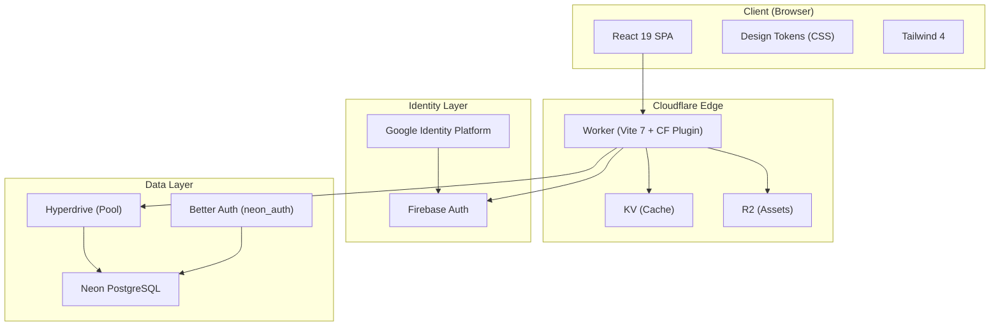
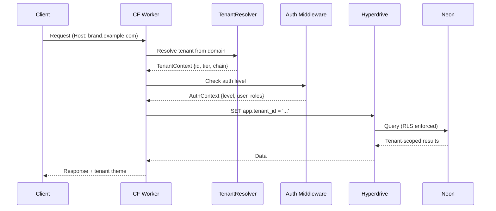

# Architecture Standard

The canonical reference for all SyncUpSuite platform projects.

---

## Principles

1. **3-tier from day one**: Every project has T0/T1/T2 tenant architecture, even if tiers are dormant
2. **Graduated auth**: Users progress from anonymous to fully authenticated without friction
3. **Tokens, not hardcodes**: Every visual decision traces through the design token pipeline
4. **Defense-in-depth**: Isolation at API, application, and storage layers
5. **Edge-first**: Cloudflare Workers as the deployment target, not origin servers
6. **Swiss-capable**: Architecture supports europe-west6 residency without rework

---

## System Architecture



---

## Tenant Architecture

```
┌─────────────────────────────────────────────────────────────┐
│                     TIER 0 — PLATFORM                       │
│  Control plane, global defaults, core design tokens         │
│  One per deployment (e.g., SyncUpSuite)                     │
├─────────────────────────────────────────────────────────────┤
│                 TIER 1 — PARTNER / BRAND                    │
│  Branded instance, own domain, manages T2 sub-tenants       │
│  Examples: BrandSyncUp, LegalSyncUp, corporate customers    │
├─────────────────────────────────────────────────────────────┤
│                  TIER 2 — END CUSTOMER                      │
│  Consumes the platform, inherits branding, scoped access    │
│  Examples: client organizations within a T1 brand           │
└─────────────────────────────────────────────────────────────┘
```

### Governance Rules

- A parent tenant **may manage** its descendants
- A tenant **may never access** siblings or ancestors
- T0 defines global defaults and protected tokens
- T1 defines brand identity and T2 autonomy policies
- T2 inherits everything by default, customizes only what's permitted

### Data Isolation

| Tier | Isolation Mode | Implementation |
|------|---------------|----------------|
| T1 | Database or Branch | Neon branch per T1, or separate database |
| T2 | Row-Level Security | `tenant_id` on all rows, RLS policies |
| Shared | Schema | `neon_auth` schema for cross-app auth |

---

## Auth Architecture

### Three Layers

```
Layer 1: IDENTITY PROVIDER
├── Firebase Auth / Google Identity Platform
├── Google OAuth, GitHub OAuth
├── Email/password flows via auth.domain.tld
├── Swiss residency (europe-west6)
└── White-label IdP pools for corporate T1 customers

Layer 2: SESSION & AUTHORIZATION
├── Better Auth in Neon (neon_auth schema)
├── Session management (7-day expiry)
├── RBAC (roles per tenant)
├── Tenant-scoped permissions
└── JWT-based sessions for Workers

Layer 3: MULTI-TENANT IdP
├── Google Identity Platform multi-tenant
├── Per-T1 identity pools
├── Corporate SSO integration
└── White-label authentication flows
```

### Graduated Access

```
ANONYMOUS         → Public content, no identity
PREVIEW           → Inquiry forms, limited features, session cookie
OAUTH             → Google/GitHub OAuth (lightweight, same clientId as Firebase)
FULL              → Better Auth session, RBAC, tenant-scoped
```

The key: using the same OAuth clientId for lightweight auth AND Firebase means graduation is seamless. Same identity, new capabilities.

---

## Design Token Architecture

### Inheritance Model

```
Platform Core Tokens (T0)
└─ Brand Tokens (T1)
   └─ Cultural Overlay (optional)
      └─ Tenant Overrides (T2, if permitted)
         └─ User Preferences (light/dark/contrast)
```

### Protected Tokens (Cannot Be Overridden)

- `color.semantic.success`
- `color.semantic.warning`
- `color.semantic.error`
- `color.semantic.focus`
- `spacing.scale`
- `motion.duration`
- `accessibility.focusRing`

### Tailwind 4 Integration

```css
@import "tailwindcss";
@import "./tokens/core.css";

@theme {
  --color-primary: var(--token-color-primary);
  --color-accent: var(--token-color-accent);
  /* Tokens flow through @theme into Tailwind utilities */
}
```

---

## Standard Stack

| Component | Technology | Why |
|-----------|-----------|-----|
| React 19 | UI framework | Concurrent features, transitions, server components ready |
| TypeScript 5.7 | Language | Strict mode, type safety across stack |
| Tailwind 4 | Styling | CSS-first config, token integration via @theme |
| Vite 7 | Build | Fast dev, @cloudflare/vite-plugin for Workers |
| Cloudflare Workers | Runtime | Edge deployment, KV/R2/Hyperdrive bindings |
| Neon PostgreSQL | Database | Serverless, branching, Hyperdrive pooling |
| Drizzle ORM | ORM | Type-safe, lightweight, good Neon support |
| Better Auth | Sessions | Neon-native, RBAC, tenant-scoped |
| Firebase | Identity | Google IdP, email delivery, Swiss residency |
| Style Dictionary | Tokens | W3C DTCG format, multi-platform output |

---

## Request Flow



---

## Performance Targets

| Metric | Target |
|--------|--------|
| Page load | < 2 seconds |
| FCP | < 1.8s |
| LCP | < 2.5s |
| Core token load | < 20KB gzip (inline) |
| Theme overlay load | < 5KB gzip (async) |
| Theme switch | < 200ms |
| Bundle chunks | < 1000KB warning |
| Lighthouse mobile | 95+ |

---

## Naming Convention

```
repo name = domain name = Google project ID
```

See `shared/conventions/naming.md` for details.

---

## Deployment

```
develop → staging.domain.tld → domain.tld
```

- Local dev: `doppler run -- npm run dev`
- Staging: `npm run deploy:staging`
- Production: `npm run deploy:production` (always confirm)
- Health: `npm run health:test`

See `shared/conventions/deployment.md` for details.
